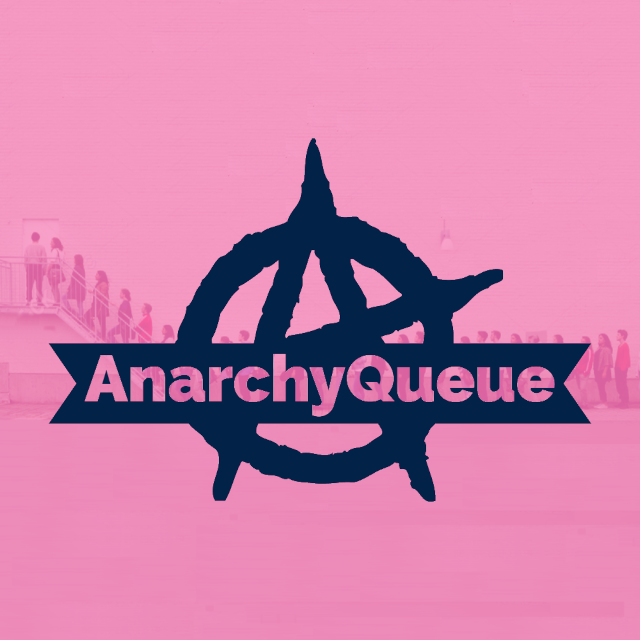

# AnarchyQueue

A simple queue system for [Velocity](https://papermc.io/software/velocity) in the style of the 2b2t queue.

---

## Details

Connects players to a queue server instance when the main server is full or restarting. The player regularly receives
information about their position in the queue.
Use a plugin like [QueueServerPlugin](https://github.com/zeroBzeroT/QueueServerPlugin/) for the queue server instance.

## Statistics

## Local Dev Environment

To start a local queue including velocity proxy and both paper servers, run the gradle tasks `runServerMain`, `runServerQueue` and `runVelocity`.

## Warranty

The Software is provided "as is" and without warranties of any kind, express
or implied, including but not limited to the warranties of merchantability,
fitness for a particular purpose, and non-infringement. In no event shall the
Authors or copyright owners be liable for any claims, damages or other
liability, whether in an action in contract, tort or otherwise, arising from,
out of or in connection with the Software or the use or other dealings in the
Software.
